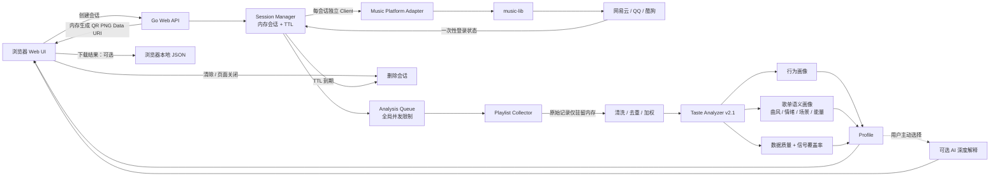

<div align="center">

# Music Taste Analyzer v0.2.1

**用户主动授权后的私人歌单读取 + 音乐口味分析**

[English](./README_EN.md) · [更新记录](./CHANGELOG.md) · [第三方依赖说明](./THIRD_PARTY_NOTICES.md)

</div>

---

一个基于用户主动授权的 **私人歌单读取 + 音乐口味分析** 项目。

> **启动本地网页 → 页面内扫码授权 → 临时读取私人歌单 → 内存分析 → 页面展示结果 → 主动清除或自动过期。**

这一版重点解决了早期测试中的三个问题：结果不再默认写到项目文件夹、登录二维码不再需要第二个 PowerShell/单独 PNG、分析结论不再只停留在“高频歌手 + 文字体系”。

## v0.2.1 主要变化

- **同页扫码**：登录 URL 由 Go 后端在内存中生成 PNG Data URI，二维码直接显示在当前网页；不调用第三方二维码服务，也不生成 `netease-login.png`。
- **默认不落盘**：Cookie、原始歌单、Profile 默认都只保存在当前 Go 进程内存，不写项目目录、不建用户数据库。
- **结果按需下载**：只有用户点击“下载本次结果”时，浏览器才在用户设备上生成 JSON 文件；长期 Profile 中的代表歌曲也不会保留原始私人歌单名称。
- **会话自动清理**：扫码、分析和结果阶段分别有 TTL；用户主动清除、关闭页面或 TTL 到期都会触发清理。
- **分析 v2.1**：新增数据清洗记录、歌本位/歌手本位、探索度、收藏占比、多歌单重复占比、曲风/情绪/场景/能量线索与“信号覆盖率”。
- **减少误判**：字符体系不再冒充演唱语言；`workout` 不会因包含 `work` 被误判为学习；`K-pop` 不会因 `pop` 被顺带判成欧美流行。
- **更可靠的歌手统计**：过滤明显噪声实体，合作歌曲权重在有效歌手之间拆分；纯噪声歌手记录不再稀释 Top Artist 占比。
- **多用户安全边界**：每个扫码会话使用独立上游 client、随机 Session Token、全局并发池与单 IP 会话上限。
- **前后端一体**：前端 HTML/CSS/JS 通过 Go `embed` 打进同一个程序，无需 Node、Python 或额外前端服务器。

---

## Windows 最简单运行方式

### 便携版

直接双击：

```text
start.bat
```

脚本按以下顺序启动：

1. `dist/music-taste.exe`（如果已经编译）；
2. 项目内 `.tools/go/bin/go.exe`；
3. 系统 Go。

浏览器会自动打开：

```text
http://127.0.0.1:8765/
```

首次从源码运行时仍需联网下载 Go 模块；音乐平台扫码授权和读取歌单本身也需要联网。

### 手动运行

```powershell
.\.tools\go\bin\go.exe run .\cmd\music-taste
```

### 编译 Windows EXE

双击：

```text
build-windows.bat
```

成功后得到：

```text
dist/music-taste.exe
```

---

## 支持平台

| 平台 | 私人歌单 | 页面扫码 | 当前状态 |
|---|---:|---:|---|
| 网易云音乐 | ✅ | ✅ | 首选实测 |
| QQ 音乐 | ✅ | ✅ QQ / 微信 | 支持 |
| 酷狗音乐 | ✅ | ✅ | 支持 |
| 汽水音乐 | ✅（上游读取能力） | ❌ | 上游扫码仍不稳定，暂不在网页开放 |

平台连接能力来自 `guohuiyuan/music-lib`。

---

## 数据存储策略

### 默认：项目文件夹里什么用户数据都不存

一次会话的默认生命周期：

```text
二维码登录态 / Cookie
        ↓ 内存
私人歌单原始记录
        ↓ 内存分析
Taste Profile（只保留聚合画像；代表歌曲不携带原始私人歌单名）
        ↓ 返回浏览器
主动清除 / 页面关闭 / TTL 到期
        ↓
Session + Profile 从会话管理器删除
```

默认不会生成：

```text
music_taste_profile.json
netease-login.png
login-qr.png
cookie.txt
用户数据库
```

注意：这里的“删除”指程序解除对这些对象的引用并从会话结构中移除，后续由 Go GC 回收内存；它不是密码学意义上的内存擦除。

### 默认 TTL

| 阶段 | 默认时间 |
|---|---:|
| 扫码授权 | 5 分钟 |
| 排队等待 | 最长 30 分钟 |
| 实际分析 | 开始执行时重新获得 30 分钟 |
| 已完成结果 | 20 分钟 |

授权一旦成功，会从短扫码 TTL 切换到排队/分析期限；真正获得分析工作位后再刷新一次分析期限，避免“扫码成功但因为排队太久，刚开始读取歌单就过期”。

---

## 分析框架 v2.1

### 1. 数据清洗层

先处理输入质量：

- 丢弃缺失歌名/歌手的记录；
- 合并同一首歌的重复记录；
- 记录清洗数量；
- 过滤“音乐治疗 / 群星 / Various Artists / 未知歌手 / 白噪音”等明显噪声歌手实体；
- 合作歌曲的总权重拆分给有效合作歌手，避免一首歌被重复算满多次。

### 2. 行为证据层

回答“用户实际做了什么”：

- 普通歌单出现：基础证据 `1`；
- `我喜欢 / 红心 / Favorites`：该次证据 `×3`；
- 同一首歌进入多个私人歌单：分别累计；
- 计算收藏歌曲占比、多歌单重复占比、Top10 歌手占比、歌手多样性。

没有真实播放次数时，**不会把收藏/歌单出现次数写成播放频率**。

### 3. 用户自我描述语义层

从用户自己的歌单名称提取：

- **曲风**：R&B / Soul、欧美流行、J-pop、K-pop、华语流行、摇滚、电子、Hip-Hop、ACG、OST……
- **情绪**：治愈、开心、伤感、浪漫、怀旧、热血……
- **场景**：夜晚、学习、通勤、运动、清晨、派对……
- **能量 / 听感**：律动抓耳、舒缓 Chill、高能动感、清新轻盈……

这些标签按**原始歌单归类证据**计算，而不是先把同一首歌去重后的总权重再次灌进每个歌单，减少重复放大。

同时输出每类信号的 **Coverage（覆盖率）**：如果用户很少给歌单起有语义的名字，系统会主动降低这类结论的可信度。

### 4. 结构画像层

生成更接近“口味结构”的判断：

- **歌本位 / 混合型 / 歌手本位**；
- **高探索 / 平衡 / 核心歌手型**；
- 代表歌曲（限制同一歌手最多占两个代表位）；
- 文字体系倾向，但明确说明它不是严格的演唱语言。

### 5. 可选 AI 深度解释

默认关闭。只有服务器配置了 OpenAI-compatible 接口，并且用户主动勾选时才调用。

发送内容限制为：

- 已聚合的 Taste Profile；
- 最多 10 首代表歌曲。

不会默认把完整私人歌单、Cookie 或登录 Token 发给 AI。AI 提示词也明确禁止在没有音频证据时编造 BPM、和弦、编曲细节或假装“听过”。

---

## 项目架构



---

## 前端 / 后端怎么组成？

不需要部署两套工程：

```text
一个 Go 程序
├── Web API / Session / Collector / Analyzer
└── 内嵌静态前端 HTML + CSS + JS
```

本地个人使用无需 PostgreSQL、Redis 或对象存储。只有未来做成多实例公开服务时，才需要考虑 Redis / 分布式队列等基础设施。

---

## HTTP API

```text
GET    /api/config
POST   /api/sessions
GET    /api/sessions/{id}
DELETE /api/sessions/{id}
GET    /healthz
```

每个会话生成不可预测的 Session ID + Session Token。状态读取和删除必须携带 `X-Session-Token`；Cookie 永远不会作为 API 响应返回浏览器。

---

## 可选 AI 配置

```powershell
$env:TASTE_LLM_BASE_URL="https://your-endpoint/v1"
$env:TASTE_LLM_MODEL="your-model"
$env:TASTE_LLM_API_KEY="..."
```

未配置时，页面不会提供 AI 深度画像选项。

---

## 公开部署前需要再做的事

本地验证版已经把数据最小化和并发边界搭好，但公开服务前仍建议：

- HTTPS 反向代理；
- 真机压力测试并根据平台限流调整 `--max-active`；
- 多实例时将会话/队列外置；
- 增加更完整的日志脱敏、可观测性和滥用防护；
- 核对音乐平台条款及上游许可证。

项目依赖 `guohuiyuan/music-lib`（AGPL-3.0）。详见 [THIRD_PARTY_NOTICES.md](./THIRD_PARTY_NOTICES.md)。
