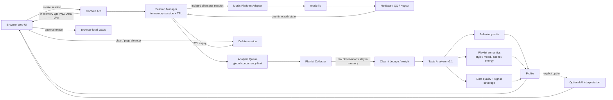

<div align="center">

# Music Taste Analyzer v0.2.1

**Private playlist access + music taste profiling, with explicit user authorization.**

[中文](./README.md) · [Changelog](./CHANGELOG.md) · [Third-party notices](./THIRD_PARTY_NOTICES.md)

</div>

---

> **Open the local Web UI → scan the QR code in the same page → temporarily read private playlists → analyze in memory → show the profile → clear explicitly or let the session expire.**

This version focuses on three issues discovered during real local testing: results are no longer written into the project directory by default, QR login no longer needs a second PowerShell window or a standalone PNG, and the analysis goes beyond a simple “top artists + writing system” summary.

## Highlights in v0.2.1

- **Same-page QR login** — one-time login URLs are converted to QR PNG Data URIs in server memory and rendered directly in the current page. No external QR service and no generated `netease-login.png`.
- **No default persistence** — cookies, raw playlists and taste profiles stay in process memory by default. No user database is created.
- **Explicit export only** — JSON is created on the user's device only after the user clicks the download action. Retained representative tracks do not include private playlist names.
- **Automatic cleanup** — login, queue, analysis and completed-result stages have bounded TTLs. Explicit clear, page cleanup or TTL expiry removes the session.
- **Analysis v2.1** — adds data-quality reporting, song-first/artist-first structure, exploration level, favorite share, multi-playlist share, style/mood/scene/energy signals and signal coverage.
- **Fewer false positives** — writing-system inference is not presented as vocal language; keyword matching avoids cases such as `workout` → `work` and `K-pop` → generic western pop.
- **Better artist statistics** — obvious noise entities are filtered and collaboration weight is split across valid artists.
- **Multi-user boundaries** — independent upstream clients, random session tokens, per-IP session caps and a global analysis concurrency limit.
- **Integrated frontend + backend** — HTML/CSS/JS are embedded into the Go binary. No Node.js, Python or separate frontend server is required.

## Quick start on Windows

### Portable layout

Double-click:

```text
start.bat
```

The script tries, in order:

1. `dist/music-taste.exe` if a compiled binary exists;
2. project-local `.tools/go/bin/go.exe`;
3. a system Go installation.

The browser opens automatically at:

```text
http://127.0.0.1:8765/
```

A first run from source still needs Internet access to download Go modules. QR authorization and playlist retrieval also require network access.

### Manual run

```powershell
.\.tools\go\bin\go.exe run .\cmd\music-taste
```

or, with system Go:

```powershell
go run .\cmd\music-taste
```

### Build a Windows executable

Run:

```text
build-windows.bat
```

The output is:

```text
dist/music-taste.exe
```

## Supported platforms

| Platform | Private playlists | Web QR login | Current status |
|---|---:|---:|---|
| NetEase Cloud Music | ✅ | ✅ | Primary real-world test path |
| QQ Music | ✅ | ✅ QQ / WeChat | Supported |
| Kugou Music | ✅ | ✅ | Supported |
| Soda Music | ✅ upstream access | ❌ | Upstream QR login is still unstable; not exposed in the Web UI |

Platform connectivity is provided by `guohuiyuan/music-lib`.

## Data-storage model

### Default: no user data is written into the project directory

```text
QR login state / Cookie
        ↓ memory
Raw private-playlist observations
        ↓ in-memory analysis
Taste Profile
        ↓ response to browser
Explicit clear / page cleanup / TTL expiry
        ↓
Session + Profile removed from session manager
```

The application does **not** generate these by default:

```text
music_taste_profile.json
netease-login.png
login-qr.png
cookie.txt
user database
```

“Removed” means references are removed from active session structures and memory is later reclaimed by Go GC. It does not claim cryptographic memory erasure.

### Default TTLs

| Stage | Default |
|---|---:|
| QR authorization | 5 minutes |
| Queue wait | up to 30 minutes |
| Active analysis | refreshed to 30 minutes when work begins |
| Completed profile | 20 minutes |

## Analysis framework v2.1

### 1. Data cleaning

- drop observations with missing track or artist names;
- merge duplicate observations for the same track;
- record cleaning counters;
- filter obvious artist/noise entities such as `Various Artists`, unknown-artist labels and white-noise style entities;
- split collaboration weight across valid artists instead of giving every collaborator the full track weight.

### 2. Behavioral evidence

The analyzer asks: **what did the user actually choose to do?**

- normal playlist placement: base evidence `1`;
- `Liked / Favorites / hearted` placement: evidence `×3`;
- the same track appearing in multiple private playlists accumulates evidence;
- favorite share, multi-playlist share, Top-10 artist concentration and artist diversity are computed.

When real play counts are unavailable, playlist placement is **not** described as listening frequency.

### 3. User-authored semantic evidence

Playlist titles are treated as the user's own labels and can contribute signals for:

- **style** — R&B / Soul, western pop, J-pop, K-pop, Mandarin pop, rock, electronic, hip-hop, ACG, OST, etc.;
- **mood** — healing, happy, sad, romantic, nostalgic, energetic, etc.;
- **scene** — night, study, commute, workout, morning, party, etc.;
- **energy / feel** — rhythmic/catchy, chill, high-energy, light/fresh, etc.

Semantic evidence is calculated from raw playlist placements rather than replaying a deduplicated track's full accumulated weight into every playlist label.

Each semantic family also reports **coverage**. If few playlist names contain useful semantic signals, the analyzer lowers confidence instead of overstating a conclusion.

### 4. Structural profile

The profile includes:

- song-first / mixed / artist-first tendency;
- high-exploration / balanced / core-artist tendency;
- representative tracks, with artist diversity constraints;
- writing-system tendency, explicitly separated from actual sung language.

### 5. Optional AI interpretation

Disabled by default. It runs only when the server is configured with an OpenAI-compatible endpoint and the user explicitly opts in.

Only the following are sent:

- the aggregated Taste Profile;
- up to 10 representative tracks.

The full private playlist, Cookie and login token are not sent by default. The AI instruction also forbids inventing BPM, harmony, arrangement details or pretending to have heard audio when no audio evidence exists.

## Architecture



## Frontend and backend

There are not two deployments to manage:

```text
one Go process
├── Web API / Session / Collector / Analyzer
└── embedded HTML + CSS + JavaScript frontend
```

For personal local use, PostgreSQL, Redis and object storage are unnecessary. Those become relevant only if the project is later turned into a multi-instance public service.

## HTTP API

```text
GET    /api/config
POST   /api/sessions
GET    /api/sessions/{id}
DELETE /api/sessions/{id}
GET    /healthz
```

Each session has an unpredictable Session ID + Session Token. Session reads and deletion require `X-Session-Token`; upstream cookies are never returned to the browser API response.

## Optional AI configuration

```powershell
$env:TASTE_LLM_BASE_URL="https://your-endpoint/v1"
$env:TASTE_LLM_MODEL="your-model"
$env:TASTE_LLM_API_KEY="..."
```

If these are not configured, the UI does not expose the AI interpretation option.

## Before public deployment

The local validation version already has data-minimization and concurrency boundaries, but a public service should still add or verify:

- HTTPS reverse proxying;
- real-device load testing and platform-specific rate-limit tuning;
- externalized sessions/queues for multiple application instances;
- stronger redacted logging, observability and abuse prevention;
- compliance review for music-platform terms and upstream licenses.

## Dependencies and licensing

This project imports `guohuiyuan/music-lib` (AGPL-3.0) and `skip2/go-qrcode` (MIT). See [THIRD_PARTY_NOTICES.md](./THIRD_PARTY_NOTICES.md) before redistribution or public deployment.
